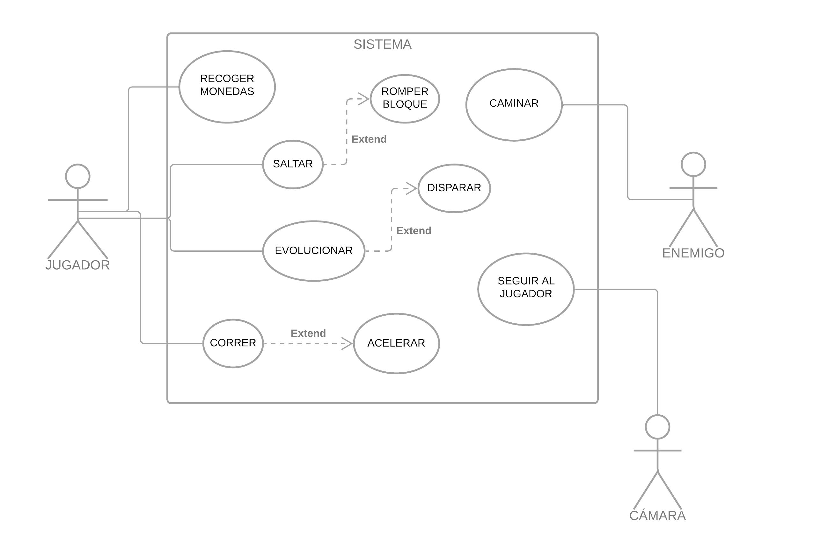

# SUPER CEBOLLA COOL

## Resumen
Super Cebolla ha salido de la tierra para recorrer con estilo los mundos de Mario. Su sueño es llegar al castillo de Peach y vivir un “felices para siempre” en su huerto. No está dispuesta a compartir espacio con setas y mucho menos permitirá que las tortugas devoren su preciosa melena. Cualquiera que se ponga en su camino… ¡sufrirá las consecuencias de su oloroso superpoder!

* Género: plataformas
* Plataforma: PC
* Público objetivo: destinado a los amantes de Mario en sus primeras versiones
* Nº jugadores: singleplayer 
* Estilo gráfico y referencias: New Super Mario Bros para Nintendo DS

## Loops
### Loop principal
* Jugador:
   * Avanzar o retroceder a una velocidad constante tras pulsar una tecla. 
   * Saltar hasta cierta altura tras pulsar una tecla.
   * Recoger monedas cuando las toque, haciendo que el contador de monedas aumente y el objeto moneda se destruya.
   * Verificar si el contador de monedas llegó a una cantidad específica para aumentar una vida.
   * Evolucionar tras tocar un objeto gota de agua.
   * Disparar tras pulsar una tecla y estar en la segunda evolución.
   * El proyectil viajará a una velocidad constante y si impacta contra un enemigo lo destruye.
* Enemigos:
   * Caminar a una velocidad constante en dirección contraria al jugador.
   * Comprobar si toca a un jugador para dañarlo o hacerle perder (según el estado en que se encuentre).
* Condición de victoria:
   * Comprobar si el jugador cruzó la bandera.
* Cámara:
   * Seguir la posición del jugador ignorando los saltos.

### Loops secundarios
* El jugador puede romper bloques saltando debajo de ellos.
* El jugador puede aumentar su velocidad de movimiento pulsando otra tecla.

## Características del juego
* Espacio de juego: personajes en 3D con movimiento restringido a 2D.
* Punto de vista y movimiento de la cámara: la cámara sigue al jugador en el plano horizontal. manteniéndole centrado, pero no le sigue en el plano vertical cuando salta.
### Jugador
* El jugador comienza teniendo x vidas, cuando muere vuelve al comienzo de la pantalla y se resta una.
* Cada pantalla tiene un cronómetro.
* El jugador puede saltar y moverse hacia delante o hacia atrás.
* El jugador puede coger monedas.
* El jugador puede eliminar enemigos, saltando sobre ellos o disparándolos, según la evolución en la que se encuentre.
* Hay un contador de monedas, x monedas se convierten en una vida extra.
* Hay zonas de caída en las que el jugador muere directamente.
* El jugador tiene 2 estados de evolución equivalentes a vida:
   * Estado 1 (Visualización sin pelo): si un enemigo le toca se muere.
   * Estado 2 (Visualización con pelo y capacidad de disparo): si un enemigo le toca se cambia a Estado 1 y se hace invulnerable durante x segundos (parpadeo del personaje).
* Tiene inercia cuando se desplaza.
### Enemigos
* Su movimiento se activa cuando entran por 1ª vez en el campo de visión del jugador.
* Se mueven en una dirección y a una velocidad fijas.
* Si tocan al jugador cuando está en Estado 1, el jugador muere.
* Cuando dos enemigos se chocan, cambian el sentido de su movimiento.
* Si tocan al jugador cuando está en Estado 2, el jugador cambia al Estado 1.
* Si el jugador está en Estado 2 y les dispara, se mueren.
* Tipos de enemigo:
   * Setas: cuando el jugador salta encima se eliminan.
   * Tortugas: cuando el jugador salta encima la primera vez se quedan inactivos durante 8 segundos. Si el jugador vuelve a saltar encima cuando están inactivos se eliminan.

### Powerups
* Están dentro de bloques determinados y salen cuando el jugador choca en el bloque saltando desde abajo.
* Dependen del Estado del jugador:
   * Si el jugador está en Estado 1 saldrá una gota de agua.
   * Si el jugador está en Estado 2 saldrá abono.
* Características:
   * Gota de agua: hace que el personaje cambie del Estado 1 al Estado 2.
   * Abono: hace que el disparo del personaje alcance más casillas.

## Historia

Super Cebolla cobró vida y ahora se encuentra avanzando hacia delante, con el propósito claro de llegar al castillo de Peach. No importa lo difícil que sea el camino, cada vez estará más cerca de lograr su objetivo.

